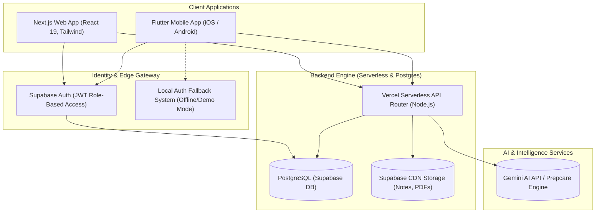
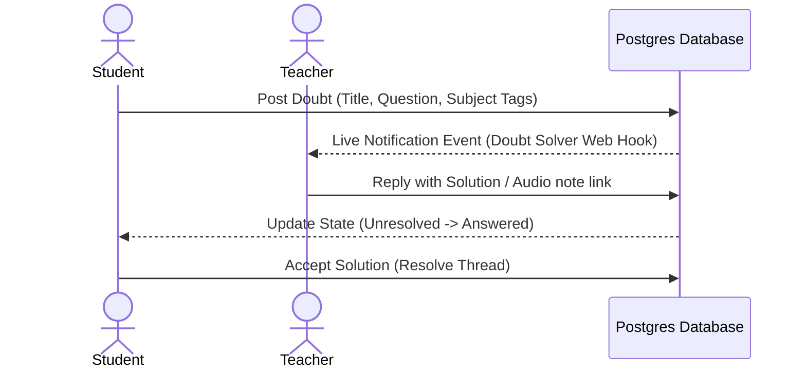
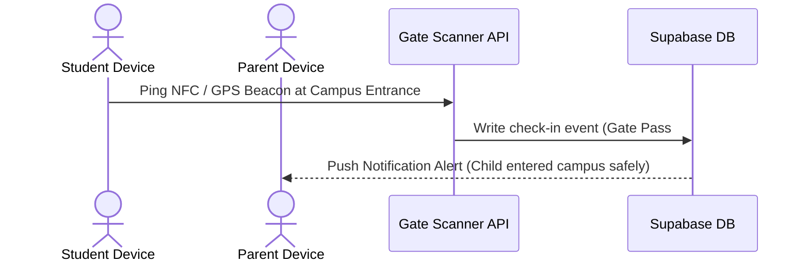
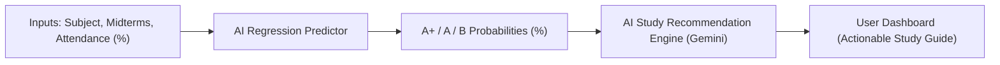

# Connect & Prep: System Architecture Specification

This document provides a detailed architectural blueprint of the **Connect & Prep** college platform. It outlines the multi-tier system topology, database schemas, role-based flowcharts, and cross-platform integrations supporting Students, Faculty (Teachers), and Parents.

---

## 1. System Topology Overview

Connect & Prep is designed as a hybrid platform consisting of a **Web Application** (Next.js) for desktop-first administration and heavy interaction, and a **Mobile Application** (Flutter) optimized for real-time mobile push notifications, offline compatibility, and security. Both environments consume a single, synchronized database backend powered by **Supabase**.



---

## 2. High-Level Technology Stack

### Web Platform
*   **Framework:** Next.js (App Router, React 19)
*   **Styling:** Custom CSS + Theme Utilities (Modern white-themed SaaS / HSL tailwind colors)
*   **State Management:** React Context API (`AuthContext.jsx`)
*   **Icons:** `lucide-react`

### Mobile Platform
*   **SDK:** Flutter (Dart 3.x)
*   **State Management:** `provider` (ChangeNotifier architecture)
*   **UI/UX:** Google Fonts (Outfit & Inter), `fl_chart` for progress visualizers
*   **Offline Resilience:** Silent mock-credential fallbacks inside `AuthService` to bypass database downtime for demos.

### Backend & Cloud Services
*   **Database:** Supabase PostgreSQL
*   **Authentication:** Supabase Auth (JWT token generation, metadata claims for roles)
*   **AI Integration:** Gemini API via serverless endpoint routes
*   **Storage:** Supabase Storage buckets for hosting notes, past year papers (PYQs), and student submissions.

---

## 3. Role-Based Access Control (RBAC) Matrix

Users are assigned one of three structural roles inside Supabase user metadata upon signup or mock authentication:

| Feature Module | Student Role | Teacher (Faculty) Role | Parent Role |
| :--- | :--- | :--- | :--- |
| **Dashboard Views** | Streaks, study hours charts, pending tasks | Class schedules, unsolved doubts, pending reviews | Child GPA trends, safety checks, fee balances |
| **Doubt Solver** | Post doubt, comment, add tags | Review questions, answer doubts, mark resolved | View-only access to academic doubts |
| **Notes & PYQs** | View, download PDFs | Upload new materials, draft exam questions | View academic resources |
| **Project Hub** | Register team, link Github, view remarks | Assign mentors, approve projects, write remarks | View project titles and statuses |
| **Assignment Hub** | Submit file mockups, check deadlines | Create assignments, grade submissions | View upcoming deadlines & grades |
| **Smart Predictor** | Predict own grades based on inputs | N/A | Predict child's outcomes |
| **Safety Portal** | Log entry/exit (mock) | View class check-ins | Real-time GPS/Gate check-in dashboard |
| **Finance Portal** | N/A | N/A | Pay fees, view transaction history, download bills |
| **Feedback Box** | Submit anonymous messages | View anonymous complaint logs | Submit anonymous feedback |

---

## 4. Database Schema Design (Postgres)

```mermaid
erDiagram
    users {
        uuid id PK
        string email
        string role "student | teacher | parent"
        string full_name
    }
    profiles {
        uuid id PK "FK to users.id"
        string usn UNIQUE "e.g. 4VV25EC001"
        string class_section
        uuid parent_id "FK to profiles.id (Self-referential)"
    }
    doubts {
        uuid id PK
        uuid author_id FK
        string category
        string title
        text question
        string tags
        timestamp created_at
    }
    replies {
        uuid id PK
        uuid doubt_id FK
        uuid author_id FK
        text content
        timestamp created_at
    }
    projects {
        uuid id PK
        string title
        text description
        string github_url
        string mentor_name
        string status "Initiated | Under Review | Approved"
        text remarks
    }
    project_members {
        uuid project_id PK "FK to projects.id"
        string usn PK "FK to profiles.usn"
    }
    assignments {
        uuid id PK
        string subject
        string title
        timestamp deadline
        string grade_received
        string status "Pending | Submitted | Graded"
    }
    feedbacks {
        uuid id PK
        string college_id
        string category "academic | hostel | admin"
        text content
        string daily_hash "HMAC Decoupler"
        timestamp created_at
    }

    users ||--|| profiles : "extends"
    profiles ||--o{ doubts : "posts"
    doubts ||--|{ replies : "has"
    projects ||--|{ project_members : "contains"
    profiles ||--o{ project_members : "joins"
    assignments ||--o{ profiles : "assigned to"
    feedbacks }o--|| users : "anonymously decoupled"
```

### Key Security & Privacy Mechanics
1.  **HMAC Feedback Decoupling:** When a student or parent posts to the `feedbacks` table, no foreign key links to `users` or `profiles`. Instead, a daily cryptographic HMAC SHA256 string is generated using `userId` and a rotating `daily_salt`. This acts as a sliding rate-limiter check on the backend, ensuring a user can only submit 3 complaints a day, but their database entry remains entirely anonymous.
2.  **Mock Login Fallback:** The mobile `AuthService` handles network timeouts gracefully. If Supabase cannot be reached, demo credentials (`1/1` -> Student, `2/2` -> Teacher, `3/3` -> Parent) automatically resolve into locally constructed session payloads containing mock metadata claims, allowing seamless offline access for testing and inspections.

---

## 5. Subsystem Flows

### A. Academic Doubts Resolution Flow


### B. Campus Entry & Safety Flow


### C. Smart Exam Predictor Engine


---

## 6. Project Directories Layout (Code Structure)

### Web (Next.js) Directory
```bash
connect-and-prep-college/
├── src/
│   ├── app/                # Next.js App Router (Layouts & Pages)
│   │   ├── dashboard/      # Role-Based dashboard portals
│   │   ├── login/          # Sign-in logic
│   │   └── api/            # Serverless Node endpoints (AI, Feedbacks)
│   ├── components/         # Reusable dashboard UI blocks
│   │   ├── features/       # DoubtSolving, Timetable, Prepcare engines
│   │   └── layout/         # Navigation & global shell styling
│   └── context/            # AuthContext (Supabase Auth Listener)
├── public/                 # Static assets (logos, PDF mockups)
└── package.json            # Dependencies & overrides (React 19 compatible)
```

### Mobile (Flutter) Directory
```bash
mobile_app/
├── lib/
│   ├── config/             # Theme tokens, colors, Supabase endpoints
│   ├── services/           # AuthService (with mock fallbacks) & DB Client
│   ├── screens/            # Screen views
│   │   ├── dashboard_screen.dart     # Role-based dashboard engine
│   │   ├── project_hub_screen.dart   # Project controller
│   │   ├── parent_performance.dart   # Parent Portal (tabs)
│   │   ├── predictor_screen.dart    # Predictor UI
│   │   └── chat_screen.dart          # Study zone instant messaging
│   └── main.dart           # App bootstraper & Auth Gate listener
├── android/                # Native Android Manifest & Perms
└── pubspec.yaml            # Dart packages (fl_chart, provider)
```
