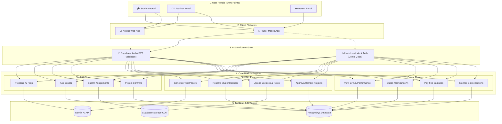

# Connect & Prep: Unified User-Flow Architecture

This diagram visualizes how the three core user roles (Student, Teacher, Parent) flow through the application interfaces (Web & Mobile), pass through Authentication, and query the synchronized Backend Services.

